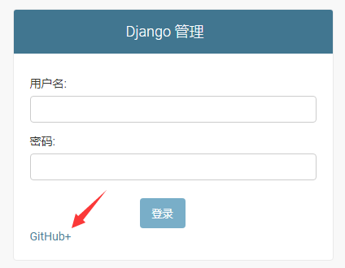
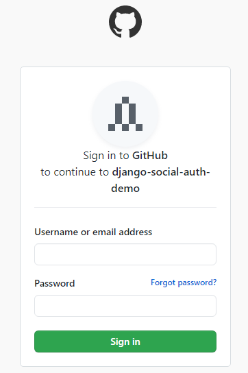
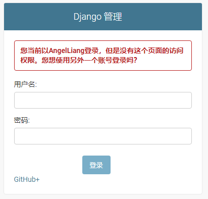

# 在 Django 中使用第三方社交认证登录示例

在 Django Admin 中添加第三方社交认证登录方式。由于 Github 申请应用比较方便，所以这里以 Github 为例。

## 环境

- Python36
- Pipenv

## 准备工作

在[github 开发者平台](https://github.com/settings/applications/new)新建一个 OAuth 应用。并填写下面信息：

- Application name: `django-social-auth-demo`（可以随意填写）
- Homepage URL: `http://127.0.0.1:8000/`
- Authorization callback URL: `http://127.0.0.1:8000/complete/github/`（固定，不能随便改动）

获取到 Client ID 和 Client Secret 后，在当前项目目录下新建`.env`并填写下面信息

    SOCIAL_AUTH_GITHUB_KEY = '<your client id>'
    SOCIAL_AUTH_GITHUB_SECRET = '<your client secret>'

## 快速开始

    pipenv install
    pipenv shell

    # 数据库迁移
    python manage.py migrate

    # 创建超级管理员
    python manage.py createsuperuser

    # 启动服务器
    python manage.py runserver

## 登录步骤

1、登录。在浏览器中输入 http://127.0.0.1:8000/admin/login 点击登录框下方的 GitHub+ 链接。

2、与 Github 绑定。之后就会跳转到 github.com 域名下面的登录页面，登录 github 帐号绑定该 OAuth 应用。

3、完成。如果该帐号拥有访问后台的权限，则在出现 Github 官方重定向页面后，会重定向到 http://127.0.0.1:8000/admin/ 后台。

## 注意事项

1、`.env`文件的环境变量没生效

进入 pipenv shell 会自动加载`.env`文件的环境变量，如果是进入 pipenv shell 后再创建（或修改）的`.env`文件，环境变量并不会生效，所以需要重新进入 pipenv shell 让环境变量生效。

2、绑定后帐号无访问后台权限

绑定 Github 帐号之后会重定向到 http://127.0.0.1:8000/admin/ ，但由于新建的帐号可能没有访问后台的权限，所以会重定向到登录页面并显示错误。此时可以登录超级管理员帐号，手动勾选该帐号权限的人员状态，允许登录后台即可。
